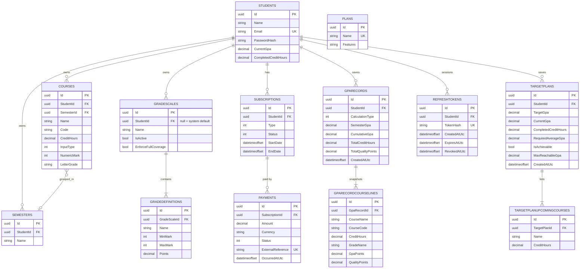

# Database ERD

SQL Server · EF Core 10 code-first · migrations in `GPAHub.Infrastructure/Persistence/Migrations/`.

## Entity-relationship diagram

## Column conventions

- All GPA / hours / points columns: `decimal(18,6)` (credit hours `(5,2)`, money `(18,2)`).
- Every mutable table carries a `rowversion Version` column for optimistic concurrency.
- Insert-only snapshot tables (`GpaRecordCourseLines`, `TargetPlanUpcomingCourses`) are never updated after creation.

## Relationship summary

| From | To | Cardinality | Delete behavior |
|------|----|-------------|-----------------|
| Semester → Student | Many → One | Required | Cascade |
| Course → Student | Many → One | Required | Cascade |
| GradeScale → Student | Many → One | Optional | Cascade |
| GradeDefinition → GradeScale | Many → One | Required | Cascade |
| Subscription → Student | Many → One | Required | Cascade |
| Payment → Subscription | Many → One | Optional | Cascade |
| Payment → Student | indirect | — | via subscription cascade |
| RefreshToken → Student | Many → One | Required | Cascade |
| Course → Semester | Many → One | Optional | **NoAction** — service detaches explicitly before delete (DR-014) |
| GpaRecord → Student | Many → One | Required | Cascade |
| GpaRecordCourseLine → GpaRecord | Many → One | Required | Cascade |
| TargetPlan → Student | Many → One | Required | Cascade |
| TargetPlanUpcomingCourse → TargetPlan | Many → One | Required | Cascade |

## Indexes of note

- Unique **Email** on Students.
- Unique filtered index `(StudentId, Name)` on GradeScales — scale-name uniqueness per student.
- Unique filtered index `StudentId WHERE IsActive = 1 AND StudentId IS NOT NULL` on GradeScales — guarantees exactly one active scale per student at the database level.
- Unique `(GradeScaleId, Name)` on GradeDefinitions.
- Unique **ExternalReference** on Payments — webhook idempotency.
- Composite `(StudentId, CreatedAtUtc)` on GpaRecords and TargetPlans — paged history queries.
- `StudentId` / `SemesterId` FK indexes on Courses.

## Check constraints

| Constraint | Rule |
|------------|------|
| CK_GradeDefinitions_MarkRange | `MinMark <= MaxMark AND MinMark >= 0 AND MaxMark <= 100` |
| CK_GradeDefinitions_Points | `Points >= 0` |
| CK_Courses_CreditHours | `CreditHours > 0` |
| CK_Courses_MarkRange | `NumericMark IS NULL OR (0–100)` |
| CK_Payments_Amount | `Amount >= 0` |
| CK_Subscriptions_DateRange | `EndDate IS NULL OR EndDate >= StartDate` |

## Enums (stored as int)

| Enum | Values |
|------|--------|
| `GradeInputType` | NumericMark, LetterGrade |
| `SubscriptionType` | Free, Premium |
| `SubscriptionStatus` | Active, Expired |
| `PaymentStatus` | Pending, Completed, Failed |
| `CalculationType` | Gpa, TargetPrediction |
